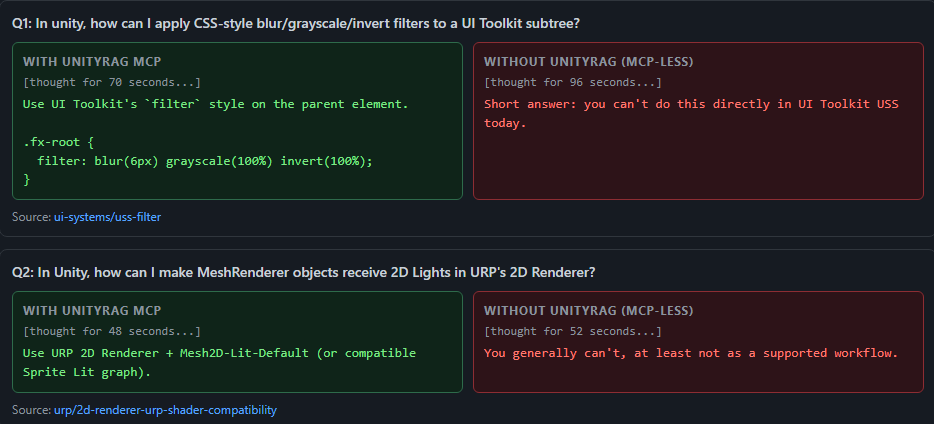

# UnityRAG



[](https://github.com/Razpines/UnityRAG/actions/workflows/ci.yml)
[](https://github.com/Razpines/UnityRAG/pkgs/container/unityrag)
[](LICENSE)
[](pyproject.toml)
[](https://github.com/Razpines/UnityRAG/stargazers)

Local Unity documentation RAG + MCP server for coding agents.

UnityRAG grounds Codex and Claude answers in official Unity offline docs for your selected version, with citations from local artifacts.

MCP tools: `search` / `resolve_symbol` / `open` / `related` / `list_files` / `status`

## Quick Start

1. Clone the repo and run setup.

```bash
git clone https://github.com/Razpines/UnityRAG.git
cd UnityRAG

# Windows
setup.bat

# macOS/Linux
bash setup.sh
```

Setup will prompt you for:
- Retrieval mode: `CUDA` (hybrid) or `CPU-only` (FTS-only)
- Unity docs version (auto-suggested from detected local Unity editor installs; you can override)
- MCP client auto-config: `Codex`, `Claude Desktop`, `Both`, or `Skip`
- Setup writes machine-local mode overrides to `config.local.yaml` (untracked), while `config.yaml` remains tracked defaults.
- MCP server configs include `UNITY_DOCS_MCP_UNITY_VERSION` so clients run against your selected docs version.

2. Restart your agent.

3. Test:
- "How do I schedule an `IJobParallelFor` with batch size?"
- "Open `Mesh.SetVertices` and show related docs."

If you chose `Skip`, configure manually using files in `examples/` with an absolute `unitydocs-mcp` path.

If setup fails, run:

```bash
unitydocs doctor
unitydocs doctor --json
unitydocs doctor --json --with-setup-snapshot
unitydocs report --summary setup-failure --prefill-issue
```

## Docker Quick Start (CPU-only)

Use the official CPU-first container image to run the MCP HTTP server without local Python/venv setup.

Run:

```bash
docker run -d --name unityrag \
  -p 8765:8765 \
  -e UNITY_DOCS_MCP_UNITY_VERSION=6000.3 \
  -v unityrag-data:/app/data \
  ghcr.io/razpines/unityrag:latest
```

Wait / first startup:
- First startup is slow: the container downloads Unity docs, bakes artifacts, and builds the FTS index.
- Watch progress with `docker logs -f unityrag`.
- Data persists across container recreation via the mounted volume (`/app/data`).

Verify:
- MCP HTTP endpoint is `http://localhost:8765/mcp`.
- A plain `GET /mcp` may return `406 Not Acceptable`; this is expected for streamable HTTP when the client does not send `Accept: text/event-stream`.

Connect (Codex CLI):

```bash
codex mcp add unity-docs-http --url http://localhost:8765/mcp
```

Common adjustments:
- Port `8765` already in use: map a different host port, for example `-p 8876:8765`, then connect to `http://localhost:8876/mcp`.
- Remote-hosted server: use `http://<host>:8765/mcp` (or your remapped host port).
- The Docker container must stay running while your MCP client is connected.

Container defaults (advanced):
- `UNITY_DOCS_MCP_ROOT=/app`
- `UNITY_DOCS_MCP_CONFIG=/app/config.docker.yaml` (FTS-only / CPU-safe)
- `UNITY_DOCS_MCP_HOST=0.0.0.0`
- `UNITY_DOCS_MCP_PORT=8765`
- `UNITY_DOCS_MCP_UNITY_VERSION` is required (set it explicitly when starting the container).

Client config details (Docker-hosted MCP):
- `docs/docker_http_clients.md`

Initial Docker scope is CPU-only / FTS-only. GPU images and Docker Compose quick start are tracked separately.

## Why UnityRAG

- Uses official Unity offline docs for versioned retrieval.
- Hybrid retrieval with SQLite FTS and FAISS vectors, or explicit FTS-only mode for CPU-only setups.
- Local-first artifacts and server operation.
- Idempotent download, bake, and index steps.

## Manual and Advanced Setup

For development and debugging, use manual setup and server start:

```bash
python -m venv .venv
# Windows: .\.venv\Scripts\activate
# macOS/Linux: source .venv/bin/activate
pip install -e .[dev]
# For CUDA/hybrid installs, use:
# pip install -e .[dev,vector]
export UNITY_DOCS_MCP_UNITY_VERSION=6000.3  # Windows PowerShell: $env:UNITY_DOCS_MCP_UNITY_VERSION='6000.3'
unitydocs install --version 6000.3 --cleanup
unitydocs mcp
```

Notes:
- In `CUDA` mode, setup scripts enforce CUDA torch and fail if no working CUDA runtime is detected.
- In `CPU-only` mode, setup configures `index.vector: none` and skips vector dependencies.

Optional advanced overrides:
- `UNITY_DOCS_MCP_UNITY_VERSION` (required for runtime commands such as `unitydocs mcp`)
- `UNITY_DOCS_MCP_ROOT`
- `UNITY_DOCS_MCP_CONFIG`
- `UNITY_DOCS_MCP_HOST`
- `UNITY_DOCS_MCP_PORT`

## Commands

```bash
unitydocs install --version 6000.3
unitydocs mcp
unitydocs doctor
unitydocs report --summary "search returned bad results" --prefill-issue
unitydocs-benchmark --dataset benchmarks/eval/unity_queries_v1.jsonl --output benchmarks/results/latest.json
unitydocs-bake
unitydocs-index --dry-run
pytest
```

## Contributing

- Read `.github/CONTRIBUTING.md`.

## Docs

- Developer details: `docs/README.md`
- Docker-hosted MCP clients: `docs/docker_http_clients.md`

## Content and Licensing

This project does not include Unity documentation. During setup, it downloads Unity's official offline docs and builds local artifacts on your machine.

Unity states code snippets are under the Unity Companion License, while other Manual and Scripting Reference content is under CC BY-NC-ND 4.0.

Do not commit `data/` artifacts.

## About

Built by an indie developer using coding agents daily, focused on reliable Unity citations over stale model memory.

More projects: https://razpines.github.io
